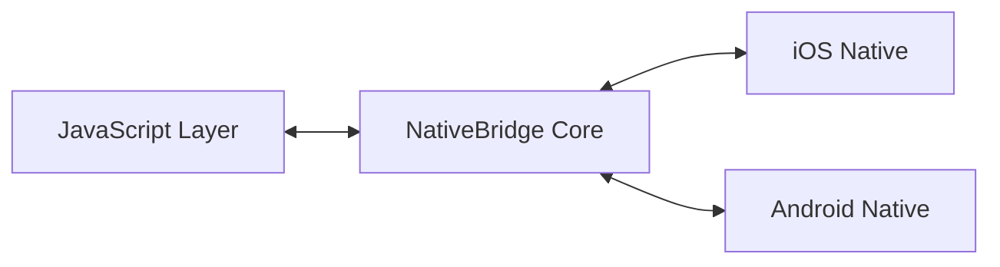

## Overview

The NativeBridge interface is the foundation of seamless communication between your JavaScript application and native iOS/Android code. It provides a unified API that abstracts platform differences while maintaining full access to native capabilities.

## Architecture

<Note>
  NativeBridge uses a message-passing architecture optimized for performance and reliability.
</Note>

### Communication Flow



## Core Components

### 1. Bridge Instance

The central orchestrator that manages all communication:

```javascript
import { NativeBridge } from '@nativebridge/core';

const bridge = new NativeBridge({
  debug: true,
  timeout: 5000,
  retry: {
    enabled: true,
    maxAttempts: 3
  }
});
```

### 2. Message Protocol

Every message between JavaScript and native follows a structured protocol:

```typescript
interface BridgeMessage {
  id: string;           // Unique message identifier
  module: string;       // Target module name
  method: string;       // Method to invoke
  params: any;          // Method parameters
  timestamp: number;    // Message timestamp
  callback?: string;    // Optional callback ID
}
```

### 3. Module Registry

Modules are registered on both JavaScript and native sides:

<Tabs>
  <Tab title="JavaScript">
    ```javascript
    // Register a JavaScript module
    bridge.registerModule('Analytics', {
      track: (event, properties) => {
        // Implementation
      },
      identify: (userId, traits) => {
        // Implementation
      }
    });
    ```
  </Tab>
  <Tab title="iOS">
    ```swift
    // Register an iOS module
    class AnalyticsModule: NativeBridgeModule {
        override func getName() -> String {
            return "Analytics"
        }
        
        @BridgeMethod
        func track(_ params: [String: Any], callback: @escaping BridgeCallback) {
            // Native implementation
            callback(.success(nil))
        }
    }
    ```
  </Tab>
  <Tab title="Android">
    ```kotlin
    // Register an Android module
    class AnalyticsModule : NativeBridgeModule() {
        override fun getName(): String = "Analytics"
        
        @BridgeMethod
        fun track(params: Map<String, Any>, callback: BridgeCallback) {
            // Native implementation
            callback.success(null)
        }
    }
    ```
  </Tab>
</Tabs>

## Method Invocation

### Synchronous vs Asynchronous

All bridge methods are asynchronous by default to prevent blocking the UI thread:

```javascript
// Async method call (recommended)
const result = await bridge.execute('Device.getInfo');

// Promise-based
bridge.execute('Device.getInfo')
  .then(result => console.log(result))
  .catch(error => console.error(error));

// Callback-based (legacy support)
bridge.execute('Device.getInfo', {}, (error, result) => {
  if (error) console.error(error);
  else console.log(result);
});
```

### Method Chaining

Chain multiple native calls efficiently:

```javascript
const chain = bridge.chain()
  .execute('Auth.getToken')
  .execute('User.getProfile', ({ token }) => ({ token }))
  .execute('Analytics.track', ({ profile }) => ({
    event: 'profile_loaded',
    userId: profile.id
  }));

const results = await chain.run();
```

## Event System

### Bidirectional Events

Both JavaScript and native code can emit and listen to events:

```javascript
// JavaScript: Listen for native events
bridge.on('bluetooth.deviceDiscovered', (device) => {
  console.log('Found device:', device.name);
});

// JavaScript: Emit to native
bridge.emit('user.action', {
  type: 'button_click',
  target: 'purchase'
});
```

<Tabs>
  <Tab title="iOS">
    ```swift
    // Listen for JavaScript events
    NativeBridge.shared.on("user.action") { data in
        print("User action: \(data)")
    }
    
    // Emit to JavaScript
    NativeBridge.shared.emit("bluetooth.deviceDiscovered", data: [
        "name": device.name,
        "uuid": device.uuid
    ])
    ```
  </Tab>
  <Tab title="Android">
    ```kotlin
    // Listen for JavaScript events
    NativeBridge.on("user.action") { data ->
        Log.d("Bridge", "User action: $data")
    }
    
    // Emit to JavaScript
    NativeBridge.emit("bluetooth.deviceDiscovered", mapOf(
        "name" to device.name,
        "uuid" to device.uuid
    ))
    ```
  </Tab>
</Tabs>

## Type Safety

### TypeScript Integration

NativeBridge provides full TypeScript support with auto-generated types:

```typescript
// types/bridge.d.ts - Auto-generated from native modules
interface BridgeModules {
  Device: {
    getInfo(): Promise<DeviceInfo>;
    vibrate(duration?: number): Promise<void>;
  };
  Storage: {
    get<T>(key: string): Promise<T | null>;
    set<T>(key: string, value: T): Promise<void>;
    remove(key: string): Promise<void>;
  };
}

// Usage with full type safety
const deviceInfo = await bridge.modules.Device.getInfo();
console.log(deviceInfo.model); // TypeScript knows the shape
```

### Runtime Validation

Validate method parameters at runtime:

```javascript
bridge.registerModule('Payment', {
  charge: bridge.method({
    params: {
      amount: 'number',
      currency: 'string',
      description: 'string?'
    },
    returns: 'PaymentResult'
  }, async (params) => {
    // Implementation with validated params
  })
});
```

## Performance Optimization

### Message Batching

Automatically batch multiple calls to reduce overhead:

```javascript
// These calls will be batched
bridge.execute('Analytics.track', { event: 'page_view' });
bridge.execute('Analytics.track', { event: 'button_click' });
bridge.execute('Analytics.track', { event: 'form_submit' });

// Force immediate batch execution
bridge.flush();
```

### Response Caching

Cache frequently accessed native data:

```javascript
// Enable caching for specific methods
bridge.configureCaching({
  'Device.getInfo': { ttl: 60000 }, // Cache for 1 minute
  'User.getProfile': { ttl: 5000 }  // Cache for 5 seconds
});

// Clear cache when needed
bridge.clearCache('Device.getInfo');
bridge.clearAllCache();
```

## Error Handling

### Error Types

```javascript
try {
  await bridge.execute('Module.method');
} catch (error) {
  if (error instanceof BridgeError) {
    switch (error.code) {
      case 'MODULE_NOT_FOUND':
        console.error('Module not registered');
        break;
      case 'METHOD_NOT_FOUND':
        console.error('Method does not exist');
        break;
      case 'TIMEOUT':
        console.error('Call timed out');
        break;
      case 'NATIVE_ERROR':
        console.error('Native exception:', error.nativeStack);
        break;
    }
  }
}
```

### Global Error Handler

```javascript
bridge.onError((error) => {
  // Log to analytics
  analytics.track('bridge_error', {
    code: error.code,
    module: error.module,
    method: error.method
  });
});
```

## Platform-Specific Features

### Conditional Execution

```javascript
// Check platform capabilities
if (bridge.supports('BiometricAuth')) {
  const result = await bridge.execute('BiometricAuth.authenticate');
}

// Platform-specific code
if (bridge.platform === 'ios') {
  await bridge.execute('iOS.requestNotificationPermission');
} else if (bridge.platform === 'android') {
  await bridge.execute('Android.requestPermissions', {
    permissions: ['CAMERA', 'LOCATION']
  });
}
```

### Feature Detection

```javascript
const features = await bridge.getFeatures();
console.log(features);
// {
//   biometric: true,
//   camera: true,
//   bluetooth: true,
//   nfc: false
// }
```

## Best Practices

<AccordionGroup>
  <Accordion icon="check" title="Do's">
    - Always handle errors gracefully
    - Use TypeScript for type safety
    - Batch related native calls
    - Cache expensive operations
    - Clean up event listeners
    - Validate inputs on both sides
  </Accordion>
  
  <Accordion icon="x" title="Don'ts">
    - Don't make synchronous blocking calls
    - Don't pass circular references
    - Don't ignore timeout configurations
    - Don't leak sensitive data in logs
    - Don't bypass the message queue
  </Accordion>
</AccordionGroup>

## Next Steps

<CardGroup cols={2}>
  <Card
    title="Native Modules"
    icon="cube"
    href="/concepts/native-modules"
  >
    Learn how to create and register native modules
  </Card>
  <Card
    title="Communication Protocol"
    icon="exchange"
    href="/concepts/communication-protocol"
  >
    Deep dive into the message protocol
  </Card>
</CardGroup>