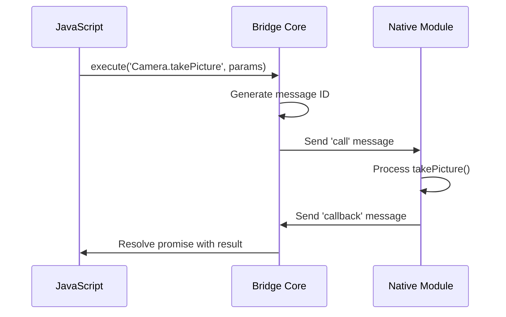
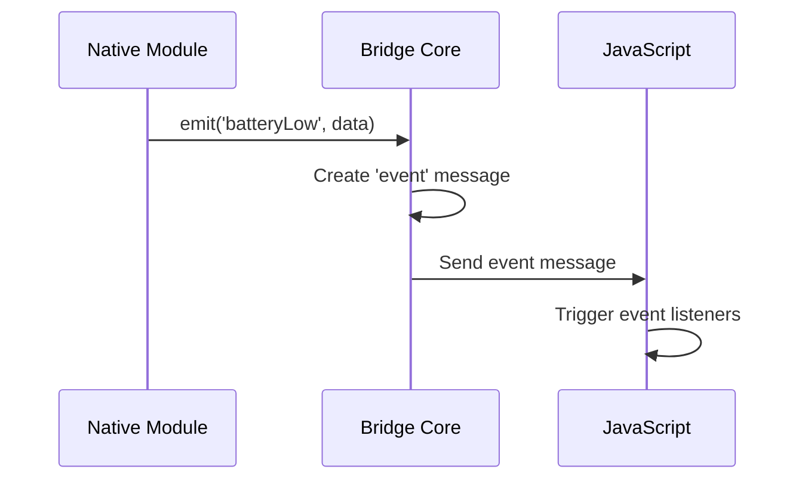

## Protocol Overview

NativeBridge uses a JSON-based message-passing protocol to enable seamless communication between JavaScript and native platforms. This protocol is designed for reliability, performance, and extensibility.

## Message Structure

### Core Message Format

Every message follows a standardized structure:

```typescript
interface BridgeMessage {
  id: string;              // Unique message identifier (UUID)
  type: MessageType;       // Message type: 'call', 'callback', 'event', 'error'
  timestamp: number;       // Unix timestamp in milliseconds
  module: string;          // Target module name
  method?: string;         // Method name (for calls)
  params?: any;            // Method parameters or event data
  callbackId?: string;     // Reference to original call (for callbacks)
  error?: BridgeError;     // Error information (for error messages)
  metadata?: MessageMetadata; // Additional message metadata
}

type MessageType = 'call' | 'callback' | 'event' | 'error' | 'ping' | 'pong';

interface MessageMetadata {
  platform: 'ios' | 'android' | 'web';
  version: string;         // Protocol version
  priority: 'low' | 'normal' | 'high';
  timeout?: number;        // Custom timeout for this message
  retry?: boolean;         // Whether this message can be retried
}
```

### Message Types

<Tabs>
  <Tab title="Call">
    ```json
    {
      "id": "msg_123456789",
      "type": "call",
      "timestamp": 1650000000000,
      "module": "Camera",
      "method": "takePicture",
      "params": {
        "quality": "high",
        "format": "jpeg"
      },
      "metadata": {
        "platform": "ios",
        "version": "1.0",
        "priority": "normal",
        "timeout": 30000
      }
    }
    ```
  </Tab>
  <Tab title="Callback">
    ```json
    {
      "id": "cb_987654321",
      "type": "callback",
      "timestamp": 1650000001000,
      "callbackId": "msg_123456789",
      "params": {
        "image": "base64encodeddata...",
        "width": 1920,
        "height": 1080
      },
      "metadata": {
        "platform": "ios",
        "version": "1.0",
        "priority": "normal"
      }
    }
    ```
  </Tab>
  <Tab title="Event">
    ```json
    {
      "id": "evt_555666777",
      "type": "event",
      "timestamp": 1650000002000,
      "module": "Battery",
      "method": "levelChanged",
      "params": {
        "level": 45,
        "isCharging": false,
        "estimatedTime": 3600
      },
      "metadata": {
        "platform": "android",
        "version": "1.0",
        "priority": "low"
      }
    }
    ```
  </Tab>
  <Tab title="Error">
    ```json
    {
      "id": "err_111222333",
      "type": "error",
      "timestamp": 1650000003000,
      "callbackId": "msg_123456789",
      "error": {
        "code": "PERMISSION_DENIED",
        "message": "Camera permission not granted",
        "domain": "Camera",
        "nativeStack": "..."
      },
      "metadata": {
        "platform": "ios",
        "version": "1.0",
        "priority": "high"
      }
    }
    ```
  </Tab>
</Tabs>

## Transport Layer

### Platform-Specific Transport

NativeBridge adapts its transport mechanism based on the platform:

<Tabs>
  <Tab title="iOS (WKWebView)">
    ```swift
    // Message injection using WKUserContentController
    class iOSBridgeTransport {
        private let webView: WKWebView
        private let messageHandler = "nativeBridge"
        
        func sendToJavaScript(_ message: BridgeMessage) {
            let jsonData = try! JSONEncoder().encode(message)
            let jsonString = String(data: jsonData, encoding: .utf8)!
            
            let script = "window.NativeBridge._handleMessage(\(jsonString));"
            
            DispatchQueue.main.async {
                self.webView.evaluateJavaScript(script) { result, error in
                    if let error = error {
                        print("Bridge transport error: \(error)")
                    }
                }
            }
        }
        
        func setupMessageHandler() {
            let contentController = webView.configuration.userContentController
            contentController.add(self, name: messageHandler)
        }
    }
    
    extension iOSBridgeTransport: WKScriptMessageHandler {
        func userContentController(_ userContentController: WKUserContentController,
                                 didReceive message: WKScriptMessage) {
            guard let messageDict = message.body as? [String: Any] else { return }
            
            // Parse and handle message
            NativeBridge.shared.handleMessage(messageDict)
        }
    }
    ```
  </Tab>
  <Tab title="Android (WebView)">
    ```kotlin
    class AndroidBridgeTransport(private val webView: WebView) {
        
        fun sendToJavaScript(message: BridgeMessage) {
            val gson = Gson()
            val jsonString = gson.toJson(message)
            val script = "window.NativeBridge._handleMessage($jsonString);"
            
            Handler(Looper.getMainLooper()).post {
                webView.evaluateJavascript(script) { result ->
                    // Handle result if needed
                }
            }
        }
        
        @JavascriptInterface
        fun postMessage(messageJson: String) {
            try {
                val gson = Gson()
                val messageMap = gson.fromJson(messageJson, Map::class.java)
                NativeBridge.handleMessage(messageMap)
            } catch (e: Exception) {
                Log.e("Bridge", "Failed to parse message: $messageJson", e)
            }
        }
    }
    
    // Setup in WebView
    webView.addJavascriptInterface(transport, "NativeBridgeAndroid")
    ```
  </Tab>
  <Tab title="React Native">
    ```javascript
    // React Native uses direct module bridging
    import { NativeModules } from 'react-native';
    
    class ReactNativeBridgeTransport {
      constructor() {
        this.nativeModule = NativeModules.NativeBridge;
      }
      
      sendToNative(message) {
        return this.nativeModule.handleMessage(JSON.stringify(message));
      }
      
      setupNativeListener() {
        const { DeviceEventEmitter } = require('react-native');
        
        DeviceEventEmitter.addListener('NativeBridgeMessage', (message) => {
          window.NativeBridge._handleMessage(JSON.parse(message));
        });
      }
    }
    ```
  </Tab>
</Tabs>

## Message Flow

### Call-Response Pattern



### Event Emission Pattern



## Message Queue Management

### Queue Processing

NativeBridge implements a sophisticated queue system for optimal performance:

```javascript
class MessageQueue {
  constructor(options = {}) {
    this.maxSize = options.maxSize || 100;
    this.flushInterval = options.flushInterval || 100;
    this.priorityQueues = {
      high: [],
      normal: [],
      low: []
    };
    this.processing = false;
    
    this.startProcessor();
  }
  
  enqueue(message) {
    const priority = message.metadata?.priority || 'normal';
    const queue = this.priorityQueues[priority];
    
    if (queue.length >= this.maxSize) {
      // Drop oldest low-priority messages
      if (priority === 'low') {
        queue.shift();
      } else {
        throw new Error('Message queue full');
      }
    }
    
    queue.push(message);
    this.scheduleFlush();
  }
  
  async flush() {
    if (this.processing) return;
    this.processing = true;
    
    try {
      // Process high priority first
      await this.processQueue('high');
      await this.processQueue('normal');
      await this.processQueue('low');
    } finally {
      this.processing = false;
    }
  }
  
  async processQueue(priority) {
    const queue = this.priorityQueues[priority];
    const batch = queue.splice(0, 10); // Process up to 10 messages
    
    if (batch.length > 0) {
      await this.processBatch(batch);
    }
  }
  
  async processBatch(messages) {
    // Send all messages in batch to native
    await this.transport.sendBatch(messages);
  }
}
```

### Batching Strategy

Messages are automatically batched for efficiency:

```javascript
class BatchProcessor {
  constructor() {
    this.pendingMessages = [];
    this.batchTimeout = null;
    this.maxBatchSize = 10;
    this.batchWindow = 50; // milliseconds
  }
  
  addMessage(message) {
    this.pendingMessages.push(message);
    
    // Send immediately if high priority or batch is full
    if (message.metadata?.priority === 'high' || 
        this.pendingMessages.length >= this.maxBatchSize) {
      this.flush();
    } else {
      this.scheduleBatchFlush();
    }
  }
  
  scheduleBatchFlush() {
    if (this.batchTimeout) return;
    
    this.batchTimeout = setTimeout(() => {
      this.flush();
    }, this.batchWindow);
  }
  
  flush() {
    if (this.batchTimeout) {
      clearTimeout(this.batchTimeout);
      this.batchTimeout = null;
    }
    
    if (this.pendingMessages.length === 0) return;
    
    const batch = this.pendingMessages.splice(0);
    this.sendBatch(batch);
  }
}
```

## Error Handling

### Error Propagation

```javascript
class ErrorHandler {
  static createBridgeError(code, message, details = {}) {
    return {
      code,
      message,
      domain: details.module || 'Bridge',
      timestamp: Date.now(),
      nativeStack: details.nativeStack,
      metadata: details.metadata
    };
  }
  
  static handleNativeError(error, originalMessage) {
    const bridgeError = this.createBridgeError(
      error.code || 'NATIVE_ERROR',
      error.message || 'Unknown native error',
      {
        module: originalMessage.module,
        nativeStack: error.stack,
        metadata: originalMessage.metadata
      }
    );
    
    // Send error response
    const errorMessage = {
      id: generateId(),
      type: 'error',
      timestamp: Date.now(),
      callbackId: originalMessage.id,
      error: bridgeError,
      metadata: originalMessage.metadata
    };
    
    return errorMessage;
  }
}
```

### Timeout Management

```javascript
class TimeoutManager {
  constructor() {
    this.pendingCalls = new Map();
    this.defaultTimeout = 5000;
  }
  
  startTimeout(messageId, timeout) {
    const timeoutMs = timeout || this.defaultTimeout;
    
    const timeoutId = setTimeout(() => {
      this.handleTimeout(messageId);
    }, timeoutMs);
    
    this.pendingCalls.set(messageId, {
      timeoutId,
      startTime: Date.now(),
      timeout: timeoutMs
    });
  }
  
  clearTimeout(messageId) {
    const pending = this.pendingCalls.get(messageId);
    if (pending) {
      clearTimeout(pending.timeoutId);
      this.pendingCalls.delete(messageId);
    }
  }
  
  handleTimeout(messageId) {
    const pending = this.pendingCalls.get(messageId);
    if (!pending) return;
    
    this.pendingCalls.delete(messageId);
    
    const error = ErrorHandler.createBridgeError(
      'TIMEOUT',
      `Call timed out after ${pending.timeout}ms`,
      { messageId }
    );
    
    // Reject the promise or trigger error callback
    this.bridge.handleError(messageId, error);
  }
}
```

## Protocol Versioning

### Version Negotiation

```javascript
class ProtocolVersionManager {
  constructor() {
    this.currentVersion = '1.0';
    this.supportedVersions = ['1.0'];
    this.negotiatedVersion = null;
  }
  
  async negotiateVersion() {
    try {
      const response = await this.sendVersionRequest();
      const commonVersion = this.findCommonVersion(response.supportedVersions);
      
      if (!commonVersion) {
        throw new Error('No compatible protocol version found');
      }
      
      this.negotiatedVersion = commonVersion;
      return commonVersion;
      
    } catch (error) {
      // Fallback to default version
      this.negotiatedVersion = '1.0';
      return '1.0';
    }
  }
  
  findCommonVersion(nativeVersions) {
    // Find the highest common version
    const common = this.supportedVersions.filter(v => 
      nativeVersions.includes(v)
    );
    
    return common.sort().pop(); // Return highest version
  }
}
```

## Performance Optimization

### Message Compression

```javascript
class MessageCompression {
  static compress(message) {
    // Simple compression for large payloads
    if (JSON.stringify(message).length > 1024) {
      return {
        ...message,
        compressed: true,
        params: this.compressData(message.params)
      };
    }
    return message;
  }
  
  static decompress(message) {
    if (message.compressed) {
      return {
        ...message,
        params: this.decompressData(message.params)
      };
    }
    return message;
  }
  
  static compressData(data) {
    // Implement compression (e.g., gzip, lz4)
    return btoa(JSON.stringify(data));
  }
  
  static decompressData(data) {
    // Implement decompression
    return JSON.parse(atob(data));
  }
}
```

### Connection Monitoring

```javascript
class ConnectionMonitor {
  constructor(bridge) {
    this.bridge = bridge;
    this.isConnected = false;
    this.pingInterval = 5000;
    this.pongTimeout = 2000;
    this.pingTimer = null;
    this.pongTimer = null;
  }
  
  start() {
    this.ping();
    this.pingTimer = setInterval(() => this.ping(), this.pingInterval);
  }
  
  stop() {
    if (this.pingTimer) {
      clearInterval(this.pingTimer);
      this.pingTimer = null;
    }
    
    if (this.pongTimer) {
      clearTimeout(this.pongTimer);
      this.pongTimer = null;
    }
  }
  
  ping() {
    const pingMessage = {
      id: generateId(),
      type: 'ping',
      timestamp: Date.now()
    };
    
    this.bridge.send(pingMessage);
    
    this.pongTimer = setTimeout(() => {
      this.handleConnectionLost();
    }, this.pongTimeout);
  }
  
  handlePong(message) {
    if (this.pongTimer) {
      clearTimeout(this.pongTimer);
      this.pongTimer = null;
    }
    
    if (!this.isConnected) {
      this.isConnected = true;
      this.bridge.emit('connectionRestored');
    }
  }
  
  handleConnectionLost() {
    if (this.isConnected) {
      this.isConnected = false;
      this.bridge.emit('connectionLost');
    }
  }
}
```

## Security Considerations

### Message Validation

```javascript
class MessageValidator {
  static validate(message) {
    const errors = [];
    
    // Required fields
    if (!message.id || typeof message.id !== 'string') {
      errors.push('Invalid message ID');
    }
    
    if (!message.type || !['call', 'callback', 'event', 'error', 'ping', 'pong'].includes(message.type)) {
      errors.push('Invalid message type');
    }
    
    if (!message.timestamp || typeof message.timestamp !== 'number') {
      errors.push('Invalid timestamp');
    }
    
    // Type-specific validation
    if (message.type === 'call') {
      if (!message.module || typeof message.module !== 'string') {
        errors.push('Invalid module name');
      }
      
      if (!message.method || typeof message.method !== 'string') {
        errors.push('Invalid method name');
      }
    }
    
    return {
      valid: errors.length === 0,
      errors
    };
  }
}
```

## Next Steps

<CardGroup cols={2}>
  <Card
    title="Data Serialization"
    icon="database"
    href="/concepts/data-serialization"
  >
    Learn how data types are handled across platforms
  </Card>
  <Card
    title="JavaScript API"
    icon="code"
    href="/api/javascript-api"
  >
    Explore the JavaScript bridge API
  </Card>
</CardGroup>